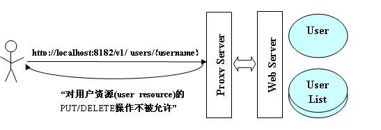
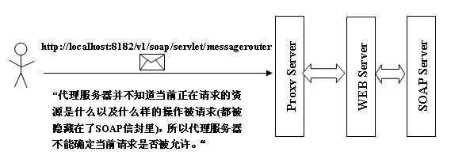
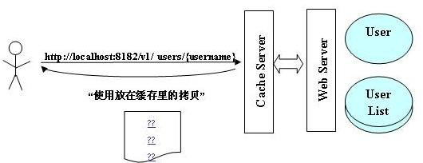
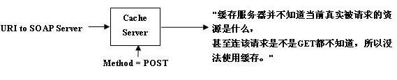

#restful架构阐述

####rest基础概念：
1. 每个URI都是资源；
2. 统一的接口，使用POST，GET，PUT，DELETE类似创建，获取，更新，删除等操作；
3. 无状态；
4. 返回数据格式：json或者xml等等

####restful框架和soap比较：
* RESTful Web 服务使用标准的 HTTP 方法 (GET/PUT/POST/DELETE) 来抽象所有 Web 系统的服务能力；
* SOAP 应用都通过定义自己个性化的接口方法来抽象 Web 服务，这更像我们经常谈到的 RPC

####下面是rest框架和soap框架服务器的请求：

rest与代理服务器

rest与缓存服务器

